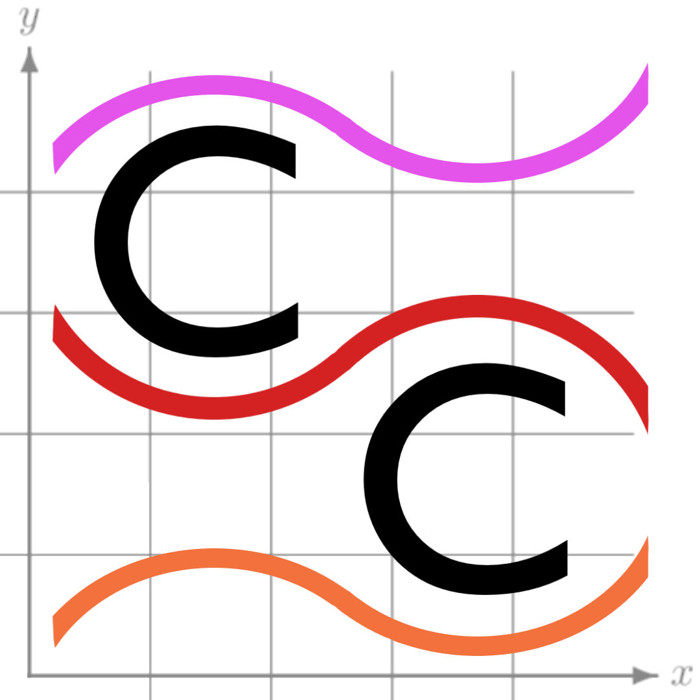
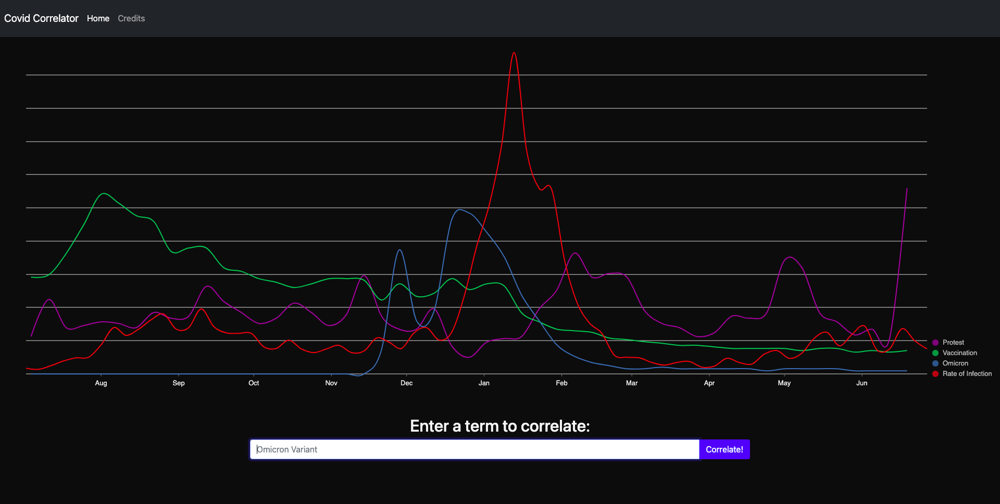

<div align="center">
  <a href="https://github.com/fryles/covid-correlator">
    
  </a>

<h3 align="center">Covid Correlator</h3>

  <p align="center">
    A React web-app built to compare the current COVID-19 rate of infection to Google Trends data for anything you can think of!
    <br />
    <a href="https://github.com/fryles/covid-correlator/issues">Report Bug or Request Feature</a>

  </p>
</div>



### Usage

Follow the instructions below and compare terms such as 'masks' or 'omicron' to demonstrate a strong correlation, other terms such as 'flights' or 'travel' may show partial correlation as well. Feel free to use any terms you want, and the web-app will automatically fit its curve to the graph.

### Deploying Yourself

Due to CORS limitations, scraping Google Trends data is only able to be done on a remote server, if only Google had an API... (wya Google??)
Thanks to this, the project is split into a React web application and a Node web server.
To deploy yourself, first clone the repo and install the required node modules

```sh
git clone https://github.com/Fryles/Covid-Correlator
cd Covid-Correlator/CC-NodeServer
npm install
cd ../CC-ReactSite
npm install
cd ..
```

Depending on where you plan to run the Node server, you will have to change the API endpoint in the graph.jsx component

```sh
vim CC-ReactSite/src/components/graph.jsx
```

Finally start the Node server

```sh
cd CC-NodeServer
npm start
```

And start the React app dev server

```sh
cd CC-ReactSite
npm start
```

### Built With

- [Next.js](https://nextjs.org/)
- [React.js](https://reactjs.org/)
- [Nivo](https://nivo.rocks)
- [Bootstrap](https://getbootstrap.com)
